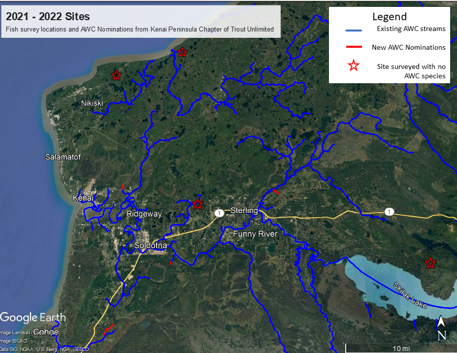

# Results

```{r , include=FALSE}
knitr::opts_chunk$set(echo = TRUE, warning = F, message = F)

# clear environment
rm(list=ls())

# load packages
library(bookdown)
library(tinytex)
library(tidyverse)
library(googlesheets4)
library(lubridate)
library(readr)
library(readxl)
library(writexl)
library(hms)
library(DT)
library(xlsx)
library(leaflet)
library(DT)
library(ggpubr)
library(plotrix)
library(packrat)
library(foreign)
library(kableExtra)

# set plotting themes

## geom_col plots theme
col_theme <- theme(axis.title = element_text(size = 14, face = "bold"),
                   strip.text = element_text(size = 14, face = "bold"),
                   legend.title = element_text(size = 14, face = "bold"),
                   legend.text = element_text(size = 14),
                   axis.text = element_text(size = 14))

## geom_points plots theme
points_theme <- theme(axis.title = element_text(size = 14, face = "bold"),
                   strip.text = element_text(size = 14, face = "bold"),
                   legend.title = element_text(size = 14, face = "bold"),
                   legend.text = element_text(size = 14),
                   axis.text = element_text(size = 11, face = "bold"),
                   title = element_text(size = 18))

# function to exclude multiple items per column
'%ni%' <- Negate('%in%')

# clarify select function
select <- dplyr::select
```

```{r, echo = F}


# notes 

## total number of sites with anad species ("n of x sites had newly id'd spp")

## 

```

```{r, echo = F}
# summarise total capture effort

## read in 
url <- "https://docs.google.com/spreadsheets/d/1S0hwY4EQo9Xtz5d4UnSBCbZoJ0ft_HGQrarfmA5dwNY/edit#gid=0"

## prep data sources

### sample events
sample_events <- read_sheet(url, sheet =  "A_Sample_Event") %>%
  # retain only TU events
  # filter(project_org == "TU") %>%
  transform(site_arrive_time = as_hms(site_arrive_time),
            site_depart_time = as_hms(site_depart_time)) %>%
  select(-QC1,-QC2,-data_entry,-notes,-crew)

### fish count
fish_dat <- read_sheet(url, sheet = "F_Fish_ID") %>%
  select(-QC1,-QC2,-data_entry)  %>%
  
  # retain only TU events by using an inner join to only dates when TU events occurred. Assumes that no other simultaneous fieldwork was done elsewhere that day
  inner_join(sample_events, by = c("site_depart_date","site"))


### how many unique sampling events (unique date/site) did we have in 2021?
n_events <- sample_events%>%
  group_by(site,site_arrive_time) %>%
  tally() %>%
  nrow() %>%
  as.character()

### how many unique event days did we have in 2021?
n_days <- sample_events%>%
  select(site_arrive_date) %>%
  distinct() %>%
  nrow() %>%
  as.character()


### number of sites

#### total value only
n_sites_total <- sample_events %>%
  group_by(site) %>%
  tally() %>%
  nrow() %>%
  as.character()

#### table of values by site
n_sites <- sample_events %>%
  group_by(site) %>%
  tally() 

### total fish
fish_ct <- fish_dat %>%
  summarise(n = sum(count)) %>%
  as.character()

### total unique species
spp_ct <- fish_dat %>%
  group_by(species) %>%
  summarise(n = sum(count)) %>%
  nrow() %>%
  as.character()

### count by species
spp_ct_n <- fish_dat %>%
  group_by(species) %>%
  summarise(n = sum(count))

### count by species at each site
site_spp_ct <- fish_dat %>%
  group_by(species,site) %>%
  summarise(n = sum(count)) %>%
  pivot_wider(names_from = "species", values_from = "n") 

### total fish at each site
total_by_site <- fish_dat %>%
  group_by(site) %>%
  summarise(total_fish = sum(count))

#### join site totals to species totals by site
z <- left_join(site_spp_ct,total_by_site)

#### remove NAs
site_spp_ct[is.na(site_spp_ct)] <- 0

```

*Note: All fishing effort and capture results are current as of `r Sys.Date()`.*

## Fish capture

During fieldwork in summer 2021 - 2023:

-   Over course of `r n_days` fieldwork days 2021 - 2023 (including the training event), we conducted a total of `r n_events` sampling events at `r n_sites_total` unique sites. See the interactive project map in the Methods section ("[Site selection](##%20Site%20selection)") for a current map of where and when sampling events have occurred. [MAP WILL BE UPDATED FOR 2023]

-   Table \@ref(tab:site-visits) summarises total samping events by individual site. We typically sampled a site only one time each.

-   We have captured `r fish_ct` fish comprised of `r spp_ct` unique species. Table \@ref(tab:ct) summarizes current fish capture count by species.

-   Table \@ref(tab:site-spp-ct) summarizes total fish capture for each species by site.

```{r, site-visits, echo = F, fig.cap = "cap"}
n_sites %>%
  kbl(caption = "Total site visits") %>%
  kable_paper(full_width = F, html_font = "Cambria")

#, 
 #             bootstrap_options = c("striped", "hover", "condensed", "responsive"))

# fix w/ webshot or make non-html
```

<br>

```{r ct, echo = F, fig.cap = "Total fish capture count by species"}

spp_ct_n %>%
  kbl(caption = "Total fish capture count by species") %>%
  kable_paper(full_width = F, html_font = "Cambria")
#, 
 #             bootstrap_options = c("striped", "hover", "condensed", "responsive"))

```

<br>

```{r site-spp-ct, echo = F, fig.cap = "cap"}

site_spp_ct %>%
  kbl(caption = "Total fish capture count by species at each site.") %>%
  kable_paper(full_width = F, html_font = "Cambria",

              bootstrap_options = c("condensed")) %>%
  kable_styling(latex_options = c("scale_down","striped")) %>%
  scroll_box(width = "100%", height = "500px")

```

<br>

## AWC Nominations

Fish capture data was evaluated against the 2022 Anadromous Waters Catalog to identify new stream segment nominations. Complete submission materials may be accessed in the project [Google Drive folder (link)](https://drive.google.com/drive/folders/1VygMPNtLJvRrKFhdDC77fmSIETm_mmtg?usp=share_link). Nominations were sent to the ADF&G Habitat Division in Anchorage in September 2022.

A total length of **3.51 miles** of stream segments were included in the nominations from fieldwork supported by KPTU activities. Table \@ref(tab:awc-noms) breaks down each nomination by length. Figure \@ref(fig:awc-noms-map)

```{r, awc-noms, echo = F, fig.cap = "cap"}

### sample events
read_sheet(url, sheet =  "awc_nominations") %>%
  select(-project_org,-year) %>%
  filter(!is.na(Site)) %>%
  kbl(caption = "AWC Nominations") %>%
  kable_paper(full_width = F, html_font = "Cambria")

```

<br>

```{r, awc-noms-map, echo = F, fig.cap = "map map"}



# transition this screenshot to a layer that highlights new segments
```

<br>


## Aquatic Resource Permit
Fish capture data was reformatted each fall in to a csv file for submission to ADF&G in fulfillment of the required [Aquatic Resource Permit](http://www.adfg.alaska.gov/index.cfm?adfg=otherlicense.aquatic_reports)[^02-results-1]; available in the online in [this project's GitHub repo](https://github.com/Kenai-Watershed-Forum/tu_awc_expansion/tree/main/output)[^02-results-2].

[^02-results-1]: <http://www.adfg.alaska.gov/index.cfm?adfg=otherlicense.aquatic_reports>

[^02-results-2]: <https://github.com/Kenai-Watershed-Forum/tu_awc_expansion/tree/main/output>


```{r, echo = F}

# prep data format for ARP report: https://www.adfg.alaska.gov/sf/SARR/AWC/index.cfm?ADFG=nomSubmit.about

# get unique sampling events (site, location, fishing method)
sample_effort <- read_sheet(url, sheet = "C_Sample_Effort") %>%
  filter(!is.na(gear_type)) %>%
  select(site,site_depart_date, gear_type) %>%
  distinct()

# join sample effort data
fish_dat <- left_join(fish_dat,sample_effort, by = c("site","site_depart_date"))

# prepare data into ARP format
arp <- fish_dat %>%
  
  # rectify ARP column named "additional count"; leave blank if count = 1, make n-1 if count > 1
  # presumed that count = 1 if additional count = 0
  mutate(`Additional count (1)` = ifelse(fish_dat$count <= 1, "0",fish_dat$count - 1)) %>%
  
  # remove extraneous columns
  select(-site_arrive_time, -site_depart_time,-photo_id, -count, -camera_id, -project_org,
         -site_arrive_date) %>%
  
  # rename existing columns
  rename(`Latitude (decimal degrees)` = latitude,
         `Longitude (decimal degrees)` = longitude,
         Date = site_depart_date,
         `Location ID (optional)` = site,
         Species = species,
         `Life stage` = lifestage,
         `Weight (g)` = wt_g,
         `Length (mm) (NO estimates or ranges)` = fl_mm,
         `Length method` = length_method,
         `Disposition (1)` = disposition,
         Comments = notes,
         `Fish collection method` = gear_type) %>%
  
  # remove extraneous columns
  select(-observer_name) %>%
  
  # create missing columns
  mutate(Datum = "",
         `Coordinate determination method` = "",
         `Name of water body` = fish_dat$site,
         `Observer name (the first and last name of the person handling fish)` = fish_dat$observer_name,
         `Age method (sample type)` = "",
         `ADF&G GCL` = "",
         `Additional count (2)` = "",
  `Disposition (2)` = "",
  `Anesthesia/ Sedative Used (Leave blank if none used)` = "",
  Sex = "",
  Age = ""
         ) %>%
  
  # order columns to match ARP
  select(
  `Location ID (optional)`,
  `Latitude (decimal degrees)`,
  `Longitude (decimal degrees)`,
  Datum,
  `Coordinate determination method`,
  `Name of water body`,
  Date,
  `Observer name (the first and last name of the person handling fish)`,
  `Fish collection method`,
  `Species`,
  `Life stage`,
  `Length (mm) (NO estimates or ranges)`,
  `Length method`,
  `Weight (g)`,
  Sex,
  Age,
  `Age method (sample type)`,
  `ADF&G GCL`,
  `Additional count (1)`,
  `Disposition (1)`,
  `Additional count (2)`,
  `Disposition (2)`,
  `Anesthesia/ Sedative Used (Leave blank if none used)`,
  Comments						
  )

# export csv to repo
write.csv(arp, "output/aquatic_resource_permit_2021.csv", row.names = F)


```
