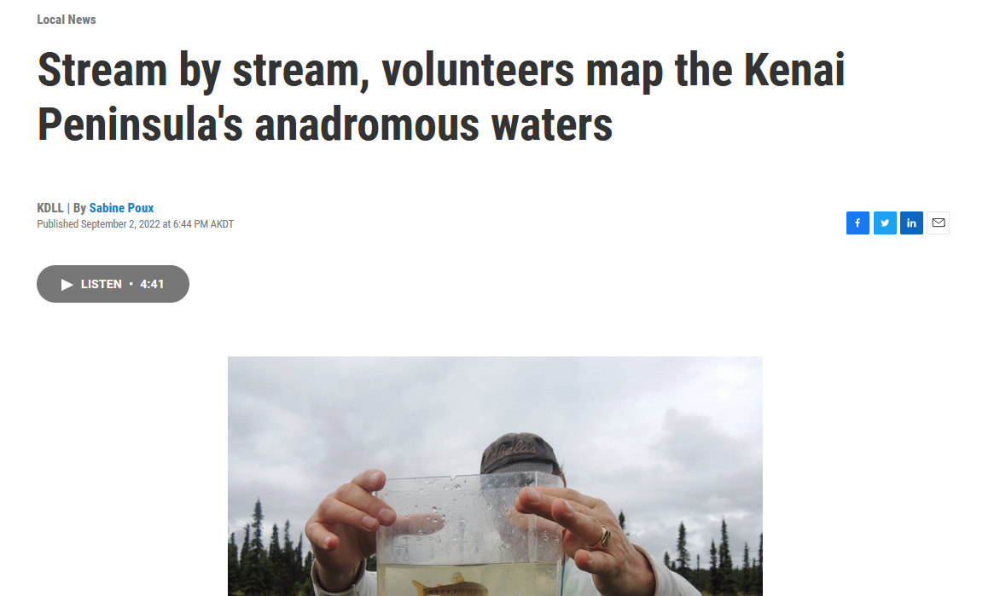

# Discussion

## 2021 Fieldwork 

### Anadromous habitat surveys

In summer 2021 we surveyed sites primarily in the region North of Kenai/Soldotna within an hour's walking distance of the road system.

Survey site selections were made by visually assessing the superimposed map layers of the Anadromous Waters Catalog with the [USGS National Hydrography Database](https://www.usgs.gov/core-science-systems/ngp/national-hydrography) (NHD)[^discussion-1]. In areas where previously documented anadromous stream or lake extents ended but connected water bodies continued upstream, we targeted sites suitable for minnow trapping and/or hook and line survey.

[^discussion-1]: <https://www.usgs.gov/core-science-systems/ngp/national-hydrography>

At sites surveyed, we captured primarily non-anadromous species such as stickleback and sculpin. We also captured some resident salmonid species such as Dolly Varden and Rainbow Trout.

These results support several conclusions that will direct future fieldwork efforts into summer 2022:

-   A need exists to refine methods for survey site selection. Relying on visual assessment of overlay between documented AWC habitat and the NHD map is frequently insufficient as a prospecting guide for yet-unidentified anadromous waters. Discussions in Fall 2021 with personnel at ADF&G's Habitat Division in Anchorage yielded valuable insight and potential for collaboration.

-   Some drainages in the North Kenai/Nikiski area that may have been historically anadromous have man-made barriers to fish passage that we identified in Summer 2021. One such example was previously undocumented as was discovered by TU volunteers, discussed further in the section below, "Highlight: Habitat Connectivity." Identifying fish passage barrier sites is a critical first step in determining if restoration is feasible.

<br>

#### Highlight: Habitat Connectivity

In one case where map interpretation suggested presence of salmonids but we captured none, we visited other locations in the watershed where fish barriers may be present. We found evidence of man-made fish barriers:

-   [Suneva Lake]{.ul} - Suneva Lake lies to the North of Daniels Lake in the Nikiski area. The lake's surface area is appx 6.0 sq km, and flows directly in to Cook Inlet 0.61 km downstream from the lake outlet. Aerial imagery indicates that littoral is \~95% undeveloped. Littoral parcels are primarily privately owned.

We conducted extensive sampling on Suneva lake, using minnow traps as well as angling. We captured stickleback and sculpin, but no salmonids despite extensive effort.

We visited the outlet at Suneva lake and discovered two perched culverts installed where the outlet stream crosses Sockeye Avenue (see figure \@ref(fig:suneva-outlet). The culvert is likely impeding fish passage (assuming no additional downstream barriers), as there is a drop of several feet between the stream channel and the culvert outlet.

A site visit to the mouth of the creek flowing from Suneva Lake at its outlet at Cook Inlet will help determine if the waterway has potential to host anadromous species and may be part of future fieldwork.

```{r suneva-outlet, echo = F, fig.cap = "Perched culvert near outlet of Suneva Lake, intersection with Sockeye Avenue "}

knitr::include_graphics('images/suneva_culvert.png')

# note: photo is rotated 90 degrees in the code chunk options due to odd behavior; photo was showing up sideways upon document knit

# for html: out.extra="style='transform:rotate(90deg);'"
```

<br>

## 2022 Fieldwork 

In Summer 2022 we focused our survey efforts on streams in the Kenai/Soldotna/Sterling area including Coal Creek, Beaver Creek, and tributaries of the Moose River. Experience from the previous season contributed to much more frequent success of identifying anadromous habitat prior to fieldwork. In 2022, four out of five site visits yielded fish observations used in AWC nominations.

In one case, at the "Moose River Trib 1.4" site, the flow line indicated by the National Hydrography Database stops ~0.3 miles downstream of the location where we captured juvenile coho salmon. Thus, this salmon-bearing location was not only not documented in the Anadromous Waters Catalog, it was not documented as a stream. 

These observations highlight the need for a more sophisticated mapping approach to generate survey sites for additional fieldwork. For additional discussion and a plan forward on this topic, see the "Next Steps" chapter.  


## Media highlights

KDLL Public Radio joined one group of volunteers on August 27, 2022 and released a four-minute story on September 2, 2022. The story also reached state-wide audiences on Alaska News Nightly. See Figure  \@ref(fig:radio-story) for the story.

```{r, radio-story, echo = F, fig.cap = "KDLL Public Radio story on September 2, 2022. Read and listen to the story at https://www.kdll.org/local-news/2022-09-02/stream-by-stream-volunteers-map-the-kenai-peninsulas-anadromous-waters"}



```
