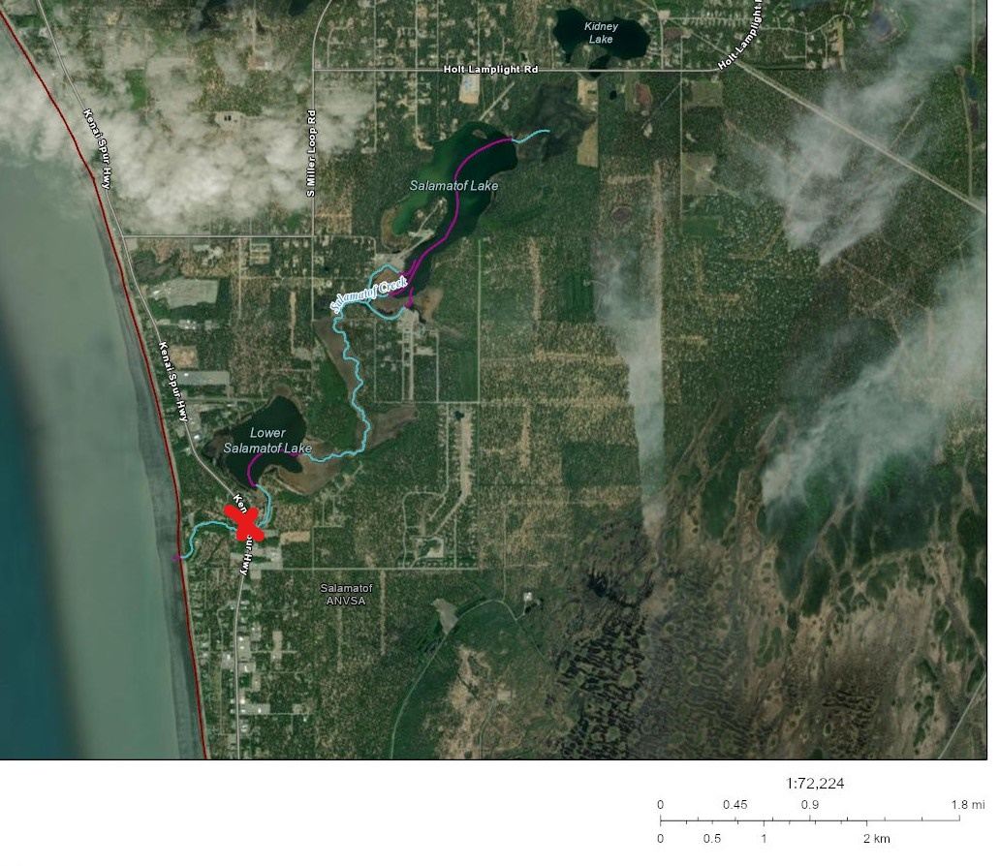

# Discussion

## 2021 Fieldwork

### 2021 Anadromous habitat surveys

In summer 2021 we surveyed sites primarily in the region North of Kenai/Soldotna within an hour's walking distance of the road system.

Survey site selections were made by visually assessing the superimposed map layers of the Anadromous Waters Catalog with the [USGS National Hydrography Database](https://www.usgs.gov/core-science-systems/ngp/national-hydrography) (NHD)[^03-discussion-1]. In areas where previously documented anadromous stream or lake extents ended but connected water bodies continued upstream, we targeted sites suitable for minnow trapping and/or hook and line survey.

[^03-discussion-1]: <https://www.usgs.gov/core-science-systems/ngp/national-hydrography>

At sites surveyed, we captured primarily non-anadromous species such as stickleback and sculpin. We also captured some resident salmonid species such as Dolly Varden and Rainbow Trout.

These results supported several conclusions that directed fieldwork efforts following summer 2022:

-   A need exists to refine methods for survey site selection. Relying on visual assessment of overlay between documented AWC habitat and the NHD map is frequently insufficient as a prospecting guide for yet-unidentified anadromous waters. Discussions in Fall 2021 with personnel at ADF&G's Habitat Division in Anchorage yielded valuable insight and potential for collaboration.

-   Some drainages in the North Kenai/Nikiski area that may have been historically anadromous have man-made barriers to fish passage that we identified in Summer 2021. One such example was previously undocumented as was discovered by TU volunteers, discussed further in the section below, "Highlight: Habitat Connectivity." Identifying fish passage barrier sites is a critical first step in determining if restoration is feasible.

<br>

#### 2021 Highlight: Lower Soldotna Creek Tributary

KWF was notified of a previously undocumented tributary segment in the Soldotna Creek drainage in July 2021. The tributary was documented as anadromous up to a road crossing approximately 100 m upstream from the Soldotna Creek mainstem, but the stream channel continued beyond. The stream segment upstream of the road crossing had been recently excavated as part of a new development project, but it was suspected that the modified channel still supported fish populations. KWF staff placed minnow traps at the most upstream locations where the traps could still be submerged. Over the course of several site visits we captured a total of 65 Coho Salmon and five Dolly Varden.

KWF submitted these data in ADFG's September 2021 call for data, and documented the approximate paths of existing stream channels, supported by several dozen ground-truthing photos. These data are displayed in the map figure below, and are also accessible at [ArcGIS Online](https://arcg.is/1XO9n5)^[https://arcg.is/1XO9n5]).


<iframe width="500" height="400" frameborder="0" scrolling="no" allowfullscreen src="https://arcg.is/0qrH45"></iframe>


The post-hoc documentation of this previously unidentified salmon stream after it has been altered emphasizes the need for continued thorough efforts to document anadromous habitat, particularly in watersheds experiencing growth and development. Communication with property owners remains critical to the task of identifying previously undocumented anadromous habitat.

<br>


#### 2021 Highlight: Habitat Connectivity

In two cases where map interpretation suggested presence of salmonids but we captured none, we visited other locations in the watershed where fish barriers may be present. We found evidence of man-made fish barriers at two locations:

1.  [Suneva Lake]{.ul} - Suneva Lake lies to the North of Daniels Lake in the Nikiski area. The lake's surface area is appx 1.0 sq km, and flows directly in to Cook Inlet 0.61 km downstream from the lake outlet. Aerial imagery indicates that littoral is \~95% undeveloped. Littoral parcels are primarily privately owned.

    We conducted sampling events on two separate days at Suneva lake, using minnow traps as well as angling. We captured stickleback and sculpin on both occasions, but no salmonids despite extensive effort.

    We visited the outlet at Suneva lake and discovered two perched culverts installed where the outlet stream crosses Sockeye Avenue (see figure \@ref(fig:suneva-outlet). The culvert is likely impeding fish passage, as there is a drop of several feet between the stream channel and the culvert outlet.

    A site visit to the mouth of the creek flowing from Suneva Lake at its outlet at Cook Inlet will help determine if the waterway has potential to host anadromous species and may be part of future fieldwork.

```{r suneva-outlet, echo = F, fig.cap = "Perched culvert near outlet of Suneva Lake, intersection with Sockeye Avenue",  out.height=400, out.extra= "angle = 90"}

knitr::include_graphics('images/suneva_culvert.png')

# note: photo is rotated 90 degrees in the code chunk options due to odd behavior; photo was showing up sideways upon document knit
```

2.  [Salamatof Creek]{.ul} - Salatamtof Creek lies North of Kenai and South of Nikiski, crossing the Kenai Spur highway. A stream connection of 1.56 km flows from Lower Salamatof Lake to Cook Inlet, and a stream segment of 2.84 km connects the lower lake to Salamatof Lake. We sampled at a site in the stream segment connecting the two lakes on one occasion in Summer 2021 and captured a several hundred sticklebacks, but no salmonids.

We visited the location where maps indicated that Salamatof Creek crosses the Kenai Spur Highway in August 2021 (figure \@ref(fig:salamatof-creek)).

At the road crossing we observed a culvert passage for Salamatof Creek below the highway, but no flowing water. The visible nearby body of water at this location appeared to be lotic in nature, and no outflow was readily evident.

```{r salamatof-creek, echo = F, fig.cap = "Salamatof Creek drainange, North of Kenai, Alaska. Red X indicates location of fish passage barrier."}



```

Based on observations at the road crossing, it is possible that historical construction activities altered the flow path of Salamatof Creek such that it no longer connects to Cook Inlet except at very high flow volumes. A review traditional knowledge in this area could help reveal if this watershed may have previously been an anadromous waterbody. Additionally, a review of historical aerial imagery could reveal how channel path or lake acreage extent may have changed in recent decades.

<br>

#### 2021 Outreach and other activities

In addition to fieldwork efforts aimed at prospecting for unidentified anadromous waters, having personnel mobilized and trained in juvenile fish identification and capture methods allowed for support in two additional efforts:

-   **Education**. In 2021 KWF oversaw 12 fish sampling events aimed exclusively at education and outreach, occurring primarily at Lower Soldotna Creek. These events introduced basic facts about wild salmon life history and habitat to local community members, visitors, journalists, and summer campers. Total participants is estimated in excess of one hundred people.

-   **Culvert replacement**. In summer 2021 KWF oversaw construction activities to replace the culvert carrying the North Fork of the Anchor River underneath Niklovaesk road in the Anchor Point area. As part of these efforts, a small segment of river channel is temporarily de-watered thus fish in this segment must be captured and released downstream prior. KWF personnel was able to capture n = 329 juvenile fish as part of these fish rescue efforts.


## 2022 Fieldwork

In Summer 2022 we focused our survey efforts on streams in the Kenai/Soldotna/Sterling area including Coal Creek, Beaver Creek, and tributaries of the Moose River. Experience from the previous season contributed to much more frequent success of identifying anadromous habitat prior to fieldwork. **In 2022, four out of five site visits yielded fish observations used in AWC nominations.**

In one case, at the "Moose River Trib 1.4" site, the flow line indicated by the National Hydrography Database stops \~0.3 miles downstream of the location where we captured juvenile coho salmon. Thus, this salmon-bearing location was not only not documented in the Anadromous Waters Catalog, it was not yet documented even as a stream.

These observations highlight the need for a more sophisticated mapping approach to generate survey sites for additional fieldwork. For additional discussion and a plan forward on this topic, see the "Next Steps" chapter.

## 2022 Media highlights

KDLL Public Radio joined one group of volunteers on August 27, 2022 and released a four-minute story on September 2, 2022. The story also reached state-wide audiences on Alaska News Nightly. See Figure \@ref(fig:radio-story) for the story.

```{r, radio-story, echo = F, fig.cap = "KDLL Public Radio story on September 2, 2022. Read and listen to the story at https://www.kdll.org/local-news/2022-09-02/stream-by-stream-volunteers-map-the-kenai-peninsulas-anadromous-waters"}

knitr::include_graphics('images/kdll_story.png')

```
