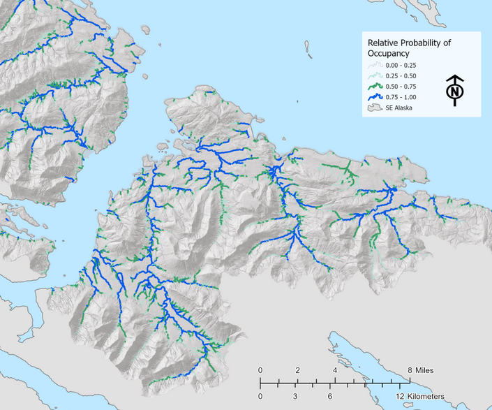

# Future Directions

```{r , romey-map, echo = F, fig.cap = "Figure from 'Southeast Alaska Fish Habitat,' Romey Fisheries and Aquatic Sciences 2021."}



```

The collaboration between the Kenai Peninsula Chapter of Trout Unlimited
and Kenai Watershed Forum serves as a compelling example of how to
engage volunteers interested in conserving fish habitat with hands-on
opportunities. There is great potential to expand and continue the work
described in this report, and a great urgency to do so.

The Anadromous Waters nominations generated as a result of this project
will play an important role in conserving salmon habitat in the areas we
surveyed. The value of educating and engaging volunteer participants is
also evident. However in a broader view, the primary take away from this
project is highlighting the need to re-frame our long term approach for
how to discover, document, and conserve anadromous habitat. Our current
methods would continue to yield additional AWC nominations, but at a
scale insufficient to keep pace with permitting in the path of new
developments. The potential to accelerate this work and document
hundreds of additional anadromous stream miles on the Kenai Peninsula is
ready at hand, and much of the initial groundwork has already been
completed and is awaiting financial support.

## Rationale for Anadromous Waters Mapping in Alaska

As described in Section 1.2 of this report, current Alaska statute is
such that rivers, streams, and lakes throughout Alaska are presumed
non-anadromous until otherwise demonstrated, thus the need for the
hands-on documentation such as that featured in this project. A failed
statewide ballot measure initiative in 2018 would have reversed the
baseline presumption of non-anadromy, among other changes to salmon
habitat regulations[^04-futuredirections-1].

[^04-futuredirections-1]: [https://ballotpedia.org/Alaska_Ballot_Measure_1,\_Salmon_Habitat_Protections_and_Permits_Initiative\_(2018)](https://ballotpedia.org/Alaska_Ballot_Measure_1,_Salmon_Habitat_Protections_and_Permits_Initiative_(2018))

Various state, federal, tribal, private, and non-profit entities have
pursued the work of documenting anadromous habitat for decades and
contributed to the detail contained within the anadramous waters
catalog. Even so, tens of thousands of miles of salmon habitat remain
undocumented, including in areas adjacent to developing urban
communities. When anadromous habitat is undocumented, proposed
development on or near these waters will not trigger the need for a Fish
Habitat Permit review from ADF&G, which requires impacts to be evaluated
along with possible mitigation requirements such as fish-friendly
culverts or enforcement of riparian buffer zones.

This dearth of detailed map information has had consequences
particularly in rapidly developing areas. For example, in Summer 2021 a
tributary Soldotna Creek was partially excavated and ditched, and was
not documented as anadromous until after the
fact[^04-futuredirections-2]. Another prominent example is when in
2008-2010, dozens of anadromous streams were documented and nominated by
The Nature Conservancy directly within the proposed footprint of Pebble
Mine; waters that had not been documented by mine consultants conducting
baseline assessments[^04-futuredirections-3]^,^[^04-futuredirections-4].
Thus the sooner that currently undocumented anadromous waters are
documented, the more likely it is that impacts can be properly evaluated
and mitigated prior to development.

[^04-futuredirections-2]: <https://bookdown.org/kwfwqx/awc_expansion/discussion.html#highlight-soldotna-creek-tributary>

[^04-futuredirections-3]: <http://www.pebblescience.org/pdfs/FishSurveysinNushagak%20and%20Kvichakheadwaters.pdf>

[^04-futuredirections-4]: <https://www.adn.com/alaska-news/article/salmon-documented-streams-top-pebble-prospect/2011/04/27/>

## Current State of Anadromous Waters Mapping

As described in section 2.1 of this report (Methods: Site Selection),
most current fieldwork efforts are prioritized by visually assessing the
overlap of stream segments in the Anadromous Waters Catalog and the
National Hydrography Database. Communication among regional researchers
and managers also helps choose fish survey locations, along with
suggestions from the general pubic. Researchers have also used formal
oral interviews with traditional knowledge holders to help suggest fish
survey locations[^04-futuredirections-5].

[^04-futuredirections-5]: Personal communication with Duncan Green,
    Alaska Department of Fish and Game, February 21, 2022

While all these methods are useful in generating ideas for survey
locations, they do not comprise a systematic approach and they are based
on incomplete stream network maps. In order for conservation needs to
better match the pace of conservation challenges, a more comprehensive
approach is needed.

Some efforts toward this end have been initiated in recent years. In the
southern Kenai Peninsula, researchers with Kachemak Bay National
Estuarine Research Reserve (KBNERR) successfully applied a predictive
habitat modeling approach in a study from 2012 ([King et al.
2012](https://www.journals.uchicago.edu/doi/abs/10.1899/11-109.1))[^04-futuredirections-6]
and added dozens of miles to the AWC from resulting efforts. However,
the approach taken by the KBNERR researchers would arguably prove
challenging to replicate at broader geographic scales, as it relies on
extensive ground truthing of habitat characteristics and flow to produce
the predictive models.

[^04-futuredirections-6]: <https://www.journals.uchicago.edu/doi/abs/10.1899/11-109.1>

Another similar approach to anadromous habitat mapping is currently
being applied in southeast Alaska by the U.S. Forest Service and other
partners. Using high resolution stream network maps coupled with fish
habitat intrinsic potential models, researchers are able to predict the
locations of upper extent of anadromy with 98% accuracy with an average
error distance of \< 67m[^04-futuredirections-7]. For more details see
the [StoryMap from Romey Fisheries and Aquatic
Sciences](https://storymaps.arcgis.com/stories/6b3949e1ebcd44c6a531d13f038807c5)[^04-futuredirections-8].

[^04-futuredirections-7]: <https://paperpile.com/app/p/e21bfd9e-9b5a-0237-ad38-12b73fbdccbb>

[^04-futuredirections-8]: <https://storymaps.arcgis.com/stories/6b3949e1ebcd44c6a531d13f038807c5>

Predicting the locations of upper anadromous extent allows researchers
to take a more informed approach to prioritzing their fieldwork of
documenting anadromous habitat. Researchers in southcentral Alaska
should aspire to emulate the approach described in the preceding
StoryMap, prioritizing surveys of waters outside the federally managed
areas of the Kenai National Wildlife Refuge and Chugach National Forest.

For future long-term efforts to effectively gather field data to be used
in AWC nominations, two general research directions are suggested:

1.  Application of higher-resolution stream network maps and habitat
    modeling approaches, such as
    [NetMap](https://www.fs.usda.gov/pnw/tools/netmap)[^04-futuredirections-9]

2.  Evaluation of "success rates" in prospecting for anadromous sites.
    E.g., how frequently, when, and where do predictions undocumented
    anadromous habitat prove correct?

3.  Formal and frequent communication and collaboration among entities
    conducting anadromous habitat survey work

[^04-futuredirections-9]: <https://www.fs.usda.gov/pnw/tools/netmap>

The combination of these approaches outlines a collaborative
"ground-truthing" type approach to AWC mapping, where remote sensing
data is used to make predictions that are then refined by field
observations. Given the near-perfect rate of predictions thus far using
this approach, in the future these maps of stream segments *predicted*
to be anadromous might be used by managers when evaluating environmental
impacts and the need for permitting and mitigation -- pending continued
model refinement, public education and support, and acceptance by
regulators.

## Next Steps

To follow though on the recommendations above, a dedicated research
project should be developed and executed in cooperation with subject
experts. The following steps describe a path forward:

1.  **Commission NetMap coverage for the Kenai Peninsula Borough**

    -   This task is already partially complete. NetMap was commissioned
        for the Chugach National Forest in 2017, and Kenai Peninsula
        coverage extends from the Prince William Sound / Turnagain Arm
        region to the western boundary with Kenai National Wildlife
        Refuge. The shapefiles are available by contacting Kenai
        Watershed Forum or Romey Fisheries and Aquatic Sciences.

    -   LiDAR, a geospatial dataset needed to produce the NetMap stream
        layers, already has complete coverage for the Kenai Peninsula
        Borough region.

    -   A quote for estimated cost was provided to Kenai Watershed Forum
        from TerrainWorks in Fall 2022.

2.  **Develop, communicate, and maintain a prioritized list of fish
    habitat survey sites shared among multiple agencies**

    -   Once a list of locations of predicted Upper Extent of Anadromy
        is generated using the NetMap layer, regional experts can use
        their knowledge of local conservation priorities to prioritize
        which sites should be surveyed first. This step will involve
        both a GIS based approach for tasks such as identifying parcel
        ownership status where sites are located, as well as a
        consensus/discussion based approach to apply knowledge of local
        conservation priorities and planning efforts.

    -   Site survey responsibilities will be assigned to participating
        organizations. Once complete, preliminary results will be
        recorded in a shared database to minimize redundant site visits.

3.  **Recruit and train participants from agency employees and
    volunteers**

    -   Entities known to currently be engaged in the work of AWC
        nominations in the Kenai Peninsula region include the following,
        but are not limited to:

        -   Alaska Department of Fish and Game Habitat Division

        -   Kenai Soil and Water Conservation District

        -   U.S. Fish and Wildlife Service

        -   Kenai Watershed Forum

        -   Kachemak Bay National Estuarine Research Reserve

        -   Kenai Peninsula Chapter of Trout Unlimited

        -   University of Alaska

    -   Training sessions would be offered to encourage participation
        from the general public

    -   Employing a consistent, user-friendly, collaborative method of
        data collection will be critical to implementing this project on
        a larger scale. ADF&G requires that AWC nominations are
        supervised by a "qualified biologist," thus careful and
        systematic review of nomination data prior to submission will be
        essential. Use of a custom-designed ESRI Survey123 app is likely
        the most appropriate choice for this task. The smartphone app
        "[Fish Map
        App](https://alaskafishmapping.org/)"[^04-futuredirections-10]
        developed by the [Indiginous Sentinals
        Network](https://www.sentinelsnetwork.org/) also shows potential
        to be highly useful in this process; though currently the app is
        not yet designed to record some essential information such as
        gear effort.

    -   A high degree of location accuracy (\<1m) is required for
        ground-truthing NetMap data. Expensive options such as Trimble
        hand held devices may be inaccessible, thus it is suggested to
        train participants to use bluetooth accessory receivers (e.g.
        [Bad Elf GNSS
        Surveyor](https://bad-elf.com/pages/be-gps-3300-detail)) when
        recording coordinates.
        
        
```{r echo = F}
# incorporare discussion on trial run of EoA modeling
```
        

[^04-futuredirections-10]: <https://alaskafishmapping.org/>

A suggested initial approach is to use the already-existing NetMap layer
covering the Chugach National Forest region in the process described
above. Pending successful results and AWC nominations, the project as
described above should be commissioned and executed at the scale of the
entire Kenai Peninsula Borough region. Many other regions of Alaska have
already had synthetic stream networks developed and mapped. Following
the success of the work proposed above, the approach would be able to be
replicated state-wide.

## Final Words

While this report shows how much has been accomplished in documenting
local salmon habitat, it is clearer than ever how much remains to be
accomplished. We are grateful for the help and support of the dozens of
volunteers involved with making this project happen and we look forward
to continuing our efforts together.
