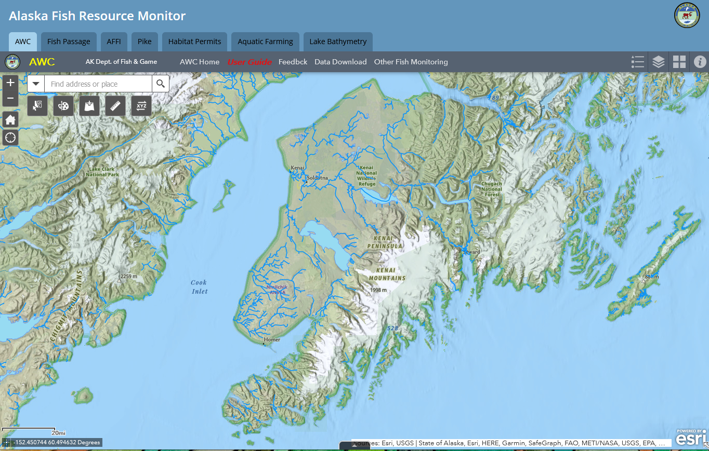

# Introduction

```{r , include=FALSE}
knitr::opts_chunk$set(echo = TRUE, warning = F, message = F)

# clear environment
rm(list=ls())

# load packages
library(bookdown)
library(tinytex)
library(tidyverse)
library(googlesheets4)
library(lubridate)
library(readr)
library(readxl)
library(writexl)
library(hms)
library(plotly)
library(DT)
library(xlsx)
library(leaflet)
library(DT)
library(ggpubr)
library(plotrix)
library(packrat)
library(foreign)

# set plotting themes

## geom_col plots theme
col_theme <- theme(axis.title = element_text(size = 14, face = "bold"),
                   strip.text = element_text(size = 14, face = "bold"),
                   legend.title = element_text(size = 14, face = "bold"),
                   legend.text = element_text(size = 14),
                   axis.text = element_text(size = 14))

## geom_points plots theme
points_theme <- theme(axis.title = element_text(size = 14, face = "bold"),
                   strip.text = element_text(size = 14, face = "bold"),
                   legend.title = element_text(size = 14, face = "bold"),
                   legend.text = element_text(size = 14),
                   axis.text = element_text(size = 11, face = "bold"),
                   title = element_text(size = 18))

# function to exclude multiple items per column
'%ni%' <- Negate('%in%')

# clarify select function
select <- dplyr::select
```

```{r juv-salmon1, echo = F, fig.cap = "Juvenile Coho Salmon", out.width=550, out.height=400}

knitr::include_graphics('images/juv_coho1.jpeg')

```

## Synopsis

The Kenai Peninsula's watersheds are significant producers of Pacific salmon. Critical to Alaska's economic and cultural wellbeing, these salmon support fisheries both inland and throughout Cook Inlet. [The Kenai Peninsula Chapter of Trout Unlimited](https://kenaipeninsula.tu.org/)[^index-1] (KPTU) in collaboration with [Kenai Watershed Forum](https://kenaiwatershed.org/)[^index-2] (KWF) are documenting habitat for salmonid spawning, rearing, and migration in order to increase the known water bodies recognized in the Alaska Department of Fish and Game's (ADF&G's) Anadromous Waters Catalog (AWC). The AWC is Alaska's most powerful tool for regulating, protecting, and conserving anadromous fish habitat. This document contains preliminary data and analysis related to the project.

[^index-1]: <https://kenaipeninsula.tu.org/>

[^index-2]: <https://www.kenaiwatershed.org>

## Introduction

Salmon are intrinsic to the cultural and economic well being of Alaska, but cannot persist on the landscape without healthy habitat. Through strategic conservation efforts, riparian and instream habitat can continue to maintain salmon populations as well as transport marine-derived nutrients; maintain hydrology; and provide refuge during a rapidly changing climate. In recognition of the importance of protecting anadromous fish habitat, the State of Alaska enacted [Alaska Statute 16.05.871](http://www.adfg.alaska.gov/index.cfm%3Fadfg=habitatregulations.prohibited)[^index-3], Protection of Fish and Game, which requires the state to list rivers, lakes, and streams important for the spawning, rearing, or migration of anadromous fish, while also requiring the prior approval of construction or use of said waterbody that may result in adverse effects on salmon populations. In response, ADF&G began overseeing the AWC whose data is now publicly hosted online for resource managers and interested members of the public to utilize. See Figure \@ref(fig:awc-map) for ADFG's online interactive map these data.

[^index-3]: <http://www.adfg.alaska.gov/index.cfm%3Fadfg=habitatregulations.prohibited>

```{r, awc-map, echo = F, fig.cap = "Online interactive map of Alaska Department of Fish and Game's Anadromous Waters Catalog. See link at https://bit.ly/awc_map."}



```

Each year, ADF&G solicits anadromous stream nominations from statewide efforts from the previous year. Once accepted, these nominations are incorporated into the AWC and its associated atlas. To date, [the AWC includes nearly 20,000 anadromous streams, rivers, and lakes](https://www.adfg.alaska.gov/sf/SARR/AWC/index.cfm?ADFG=main.home)[^index-4], though it is widely understood that this number represents a fraction of anadromous waterbodies throughout the state. While ADF&G is conducting efforts to update existing data and survey for previously undocumented habitat, there remains a vast number of water bodies in need of surveying and habitat use observations.

[^index-4]: <https://www.adfg.alaska.gov/sf/SARR/AWC/index.cfm?ADFG=main.home>

In response, Kenai Peninsula Chapter of Trout Unlimited proposed to collect new observations of fish habitat and submit them for inclusion in the AWC. With project fundiung secured from Trout Unlimited's [Embrace-a-Stream](https://www.embraceastream.org/)[^index-5] program KPTU established formal collaboration with local non-profit [Kenai Watershed Forum](https://kenaiwatershed.org/), which has been conducting annual fish trapping events since 2005, to provide assistance with project training and logistics.

[^index-5]: <https://www.embraceastream.org/>

KWF is working with KPTU to strategically prioritize survey sites to collect fish and habitat data for AWC nomination submissions. Site prioritization is based on criteria including the increase in protected anadromous fish habitat and alignment of trapping priorities with local agency and partnership goals. These are described in greater detail in the methods section. KWF will coordinate with local agency partners to ensure that trapping isn't replicated in the same areas throughout each summer.

## Volunteer Training

On June 5, 2021 a half-day training workshop was conducted by Kenai Watershed Forum staff for fifteen Trout Unlimited volunteers, including but not limited to identifying ideal anadromous fish habitat; responsible deployment and retrieval of minnow traps; juvenile and adult fish identification; data collection and recording while in the field; and safe travel in bear country. Particpants were introduced to an [Anadromous Habitat Survey Standard Operating Procedure](https://bit.ly/kwf_awc_sop) (SOP) document^[https://bit.ly/kwf_awc_sop].

```{r, tu-volunteer, echo = F, fig.cap = "Kenai Peninsula Chapter of Trout Unlimited Volunteers."}

knitr::include_graphics('images/Fish_Trap_Seminar4.jpg')

```

## Objectives

-   Submit nominations to increase anadromous stream, river, lake, and wetland coverage in the AWC and corresponding atlas

-   Revise or corroborate outdated AWC and atlas data, particularly on Kenai River tributaries experiencing increases in zinc concentrations as well as priority corridors identified by the Kenai Mountains to Sea partnership

```{r include=FALSE}
# automatically create a bib database for R packages
knitr::write_bib(c(
  .packages(), 'bookdown', 'knitr', 'rmarkdown'
), 'packages.bib')
```
